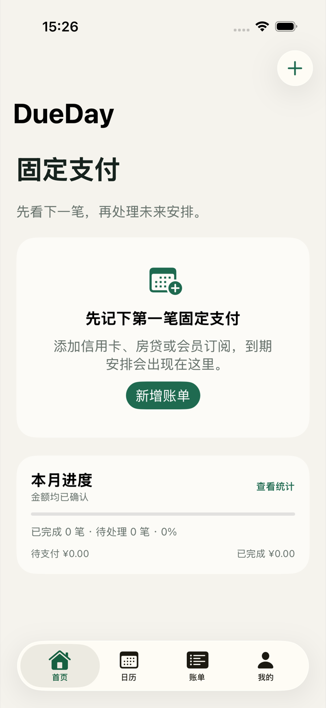
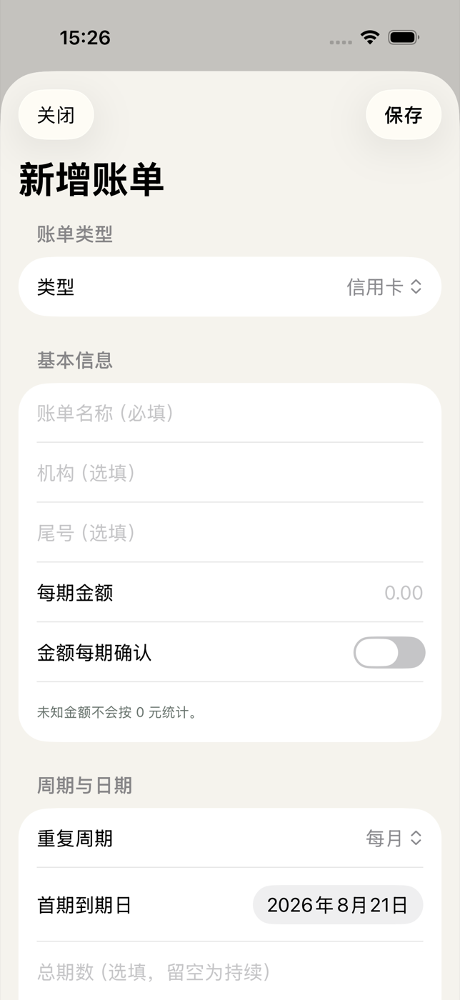
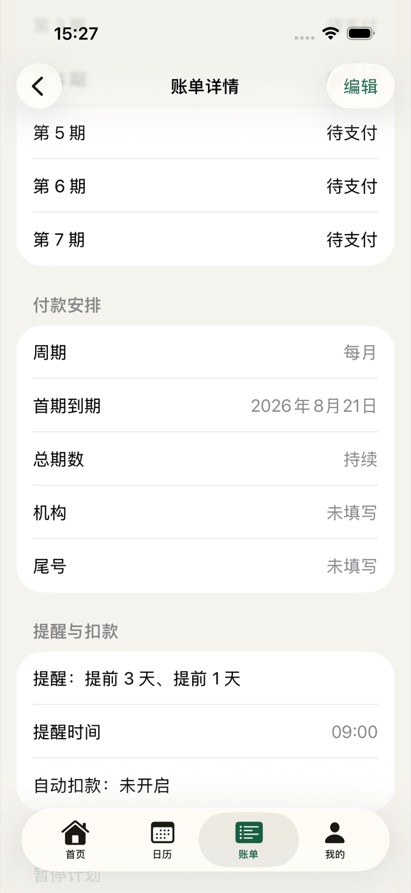
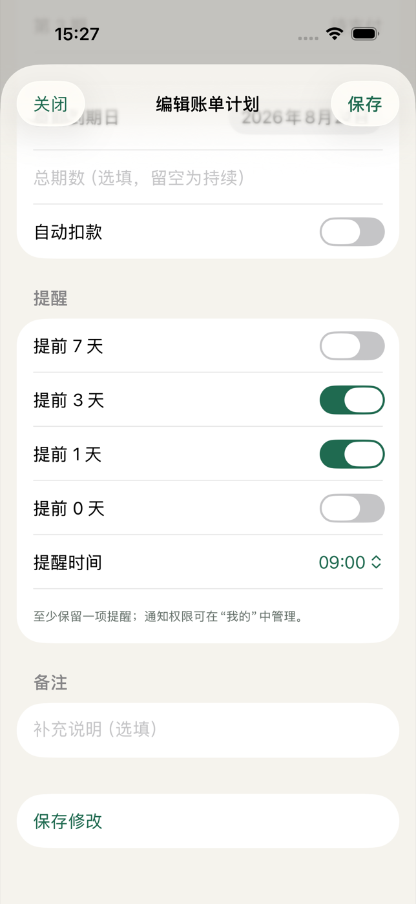
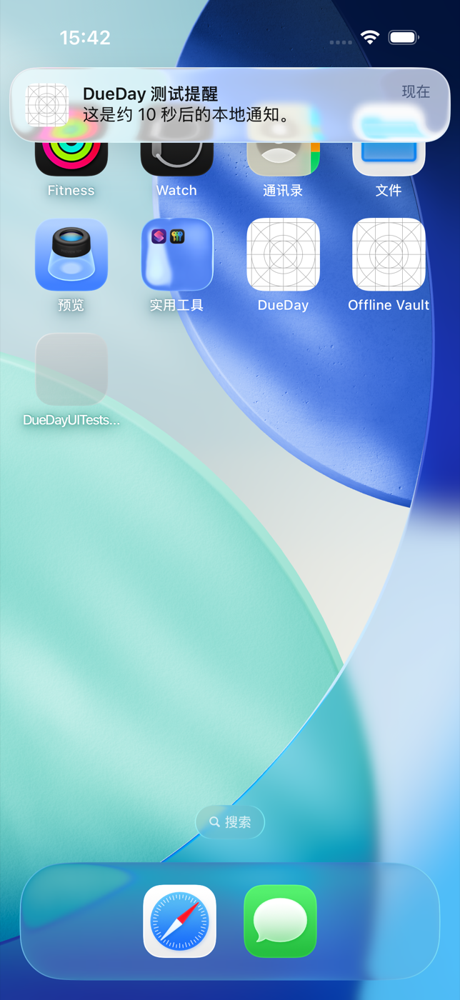
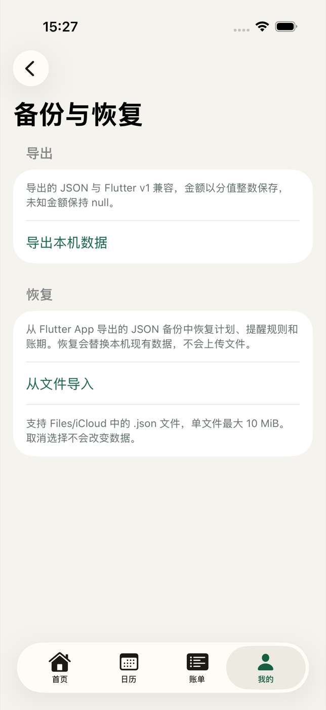

# DueDay

> A native, local-first iOS assistant for recurring bill due dates and repayment reminders.

[简体中文](README.zh-CN.md)

DueDay helps you stay ahead of recurring payments such as credit cards, loans, mortgages, insurance policies, and subscriptions. It is a payment reminder assistant—not a traditional bookkeeping app.

The primary client is now built with SwiftUI and SwiftData. It opens without login, stores data only on the device, and does not require a backend. The previous Flutter implementation remains in the repository as a compatibility and migration reference.

## Current capabilities

- Home dashboard focused on the next payment, overdue items, monthly progress, and upcoming bills.
- Calendar and bill-plan views with pending, completed, paused, and archived states.
- Create and edit recurring plans for credit cards, mortgages, loans, insurance, subscriptions, and other fixed payments.
- Monthly, quarterly, yearly, and installment schedules with optional total installment counts.
- Explicit unknown-amount handling so missing amounts are never counted as zero.
- Mark an individual period as paid, restore it to pending, skip it, pause the plan, or archive it.
- Local iOS notification permission, deterministic rescheduling, reminder settings, and a test notification.
- Local JSON export and confirmed full-replacement restore, compatible with Flutter v1 backups.
- Light/Dark appearance, Dynamic Type layouts, and iOS 26 system materials including Liquid Glass where supported.

## Screenshots

Captured from the native SwiftUI app on the iPhone 17 Simulator running iOS 26.5.

| Home | Create a bill | Bill details |
| --- | --- | --- |
|  |  |  |

| Edit a bill | Local notification | Backup and restore |
| --- | --- | --- |
|  |  |  |

## Product principles

DueDay is built around one question: **what payment needs my attention next?**

- Actionable due-date awareness over transaction bookkeeping.
- A lightweight daily check-in over a complex finance dashboard.
- Clear overdue, pending, completed, skipped, paused, and archived states.
- Local ownership of personal bill data before accounts, cloud sync, or commercial features.

## Tech stack

### Primary iOS client

- SwiftUI
- SwiftData
- UserNotifications
- iOS 17 minimum deployment target
- Native XCTest and XCUITest coverage

### Preserved Flutter client

- Flutter / Dart
- Drift SQLite
- Local notifications and JSON backup compatibility

### Deferred platform work

- Spring Boot backend based on a RuoYi `app-api` branch
- MySQL, Redis, and XXL-JOB
- Login, cloud sync, remote bill APIs, and WeChat subscription messages

## Project structure

```text
native-ios/              # Primary SwiftUI + SwiftData iOS app
├── DueDay/              # App, domain, persistence, notification, and backup code
├── DueDayTests/         # Native unit tests
└── DueDayUITests/       # Native end-to-end simulator tests

lib/                     # Preserved Flutter implementation
test/                    # Flutter tests
ios/                     # Flutter iOS host project
docs/                    # Product, migration, persistence, notification, and UI docs
```

## Run the native iOS app

1. Install Xcode and an iOS Simulator Runtime.
2. Open [`native-ios/DueDay.xcodeproj`](native-ios/DueDay.xcodeproj).
3. Select an iPhone simulator and run the `DueDay` scheme.

Command-line verification:

```bash
cd native-ios
xcodebuild -project DueDay.xcodeproj -scheme DueDay \
  -destination 'platform=iOS Simulator,name=iPhone 17,OS=26.5' \
  CODE_SIGNING_ALLOWED=NO test
```

The checked-in simulator acceptance baseline is 29 passing tests: 27 unit tests and 2 end-to-end UI tests. The main flow also passes in Dark Mode with accessibility extra-large Dynamic Type. Physical-device notification, iCloud document access, sharing, background delivery, and lock-screen presentation still require manual acceptance testing.

## Run the preserved Flutter client

```bash
flutter pub get
flutter test
flutter run -d <ios-simulator-id>
```

## Local data and migration

The native app stores bill plans and periods in SwiftData on the device. No account or bill data is uploaded. JSON backups are plain-text local files and may contain sensitive financial information, so users should store and share them carefully.

Flutter v1 backup migration is supported through **Profile → Backup & Restore → Import from File**. The app validates the file and shows a summary before replacing local data. See [`native-ios/README.md`](native-ios/README.md) for implementation and test details.

## Roadmap

- [x] Native SwiftUI iOS client
- [x] Local SwiftData persistence
- [x] Recurring plan and bill-period lifecycle
- [x] Calendar, statistics, archive, and installment flows
- [x] iOS local notifications
- [x] Flutter v1 JSON backup migration
- [x] Simulator unit and end-to-end acceptance tests
- [ ] Physical iPhone acceptance testing
- [ ] RuoYi `app-api` authentication and remote bill APIs
- [ ] Optional cloud sync and conflict handling
- [ ] WeChat Mini Program and other clients

## Status

Open-source, personal-use iOS MVP. The native version has completed simulator acceptance; physical-device acceptance remains intentionally pending.

## License

[MIT License](LICENSE)
